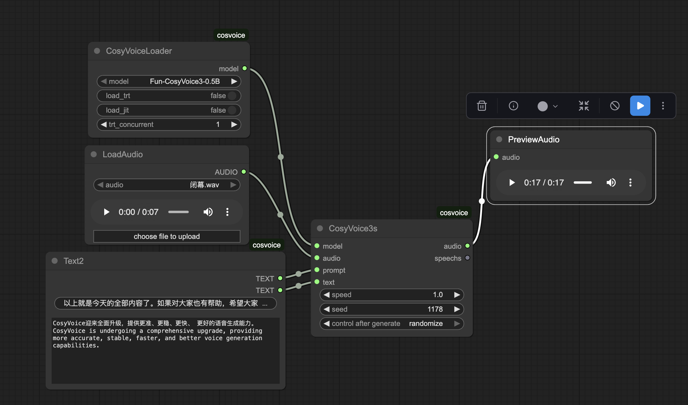

# Fun CosyVoice 3.O ComfyUI
A plugin of ComfyUI for [CosyVoice3](https://github.com/FunAudioLLM/CosyVoice)in ComfyUI, Base on torch up to 2.9.1
## Installation
In the ./ComfyUI/custom_node directory, run the following:
```sh
git clone https://github.com/benda1989/CosyVoice3_ComfyUI.git
cd CosyVoice3_ComfyUI
pip install -r requirements.txt
```
Other Environmental Dependency Check [CosyVoice3](https://github.com/FunAudioLLM/CosyVoice)
## Copy models
By default project will download CosyVoice3-0.5B and CosyVoice-ttsfrd into pretrained_models,  
You can copy it there if you downloaded before.  
file tree looks like this at least:
```sh
--  ComfyUI/custom_node/CosyVoice3_ComfyUI/pretrained_models
    |-- CosyVoice3-0.5B
    |-- CosyVoice-ttsfrd
```
## Example


### web [regenerate single sentence]
python web.py 


 
